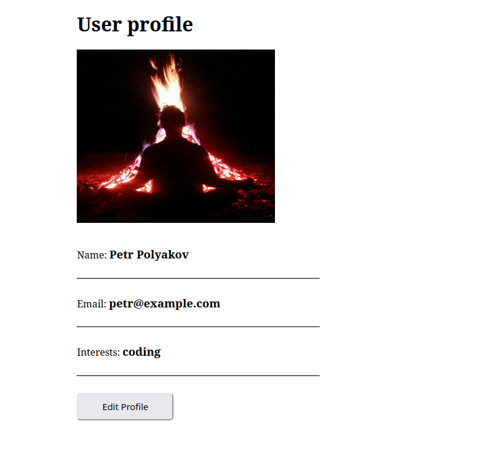

# Kubernates - bare minimum

## Текст задания

В качестве образов для двух контейнеров можно (но не обязательно) использовать уже созданные нами в модулях по Docker образы.

Единственное отличие от приведённого примера — наши образы не представлены в публичном репозитории, поэтому их нужно вручную загрузить внутрь кластера:

```bash
minikube cache add <название локального образа>
```

Кроме того, файл index.php нужно чуть переписать, т. к. у нас адрес до БД и логин/пароль прописаны статически в самом файле. А должны браться из переменных окружения.

Если используете публичные образы, проследите, чтобы образ веб-приложения брал данные для подключения к БД из переменных окружения.

Использовать уже приведённые образы запрещено.

Помимо этого, необходимо сделать таблицу (например, в формате Excel) с инвентаризацией вашего кластера. В кратком виде указать установленное ПО на нодах, количество нод, ОС на нодах, адреса.

## Условия реализации

В качестве ответа предоставьте:

- [x] все конфигурационные файлы,
  - [configmap](./1_configmap.yaml)
  - [secret](./2_mongo-secret.yaml)
  - [db](./3_database.yaml)
  - [web](./4_webapp.yaml)
- [x] скриншот из браузера с работающим веб-приложением,
  - [dashboard](./dashboard.png)
  - 
- [x] [вывод](./kube-all.txt) команды `kubectl get all -o wide`
- [x] табличку с инвентаризацией

| Сущность | По на нодах | количество нод | ОС на нодах  | адреса     |
|----------|-------------|----------------|--------------|------------|
| database | mongodb     | 1              | ubuntu jammy | 10.244.1.2 |
| webapp   | nodejs, npm | 1              | alpine linux | 10.244.1.3 |

Результаты работы загрузите на свой GitHub. В качестве ответа приложите ссылку на репозиторий.

## Commands to run cluster

```bash
# delete if exists
minikube delete -p petr-polyakov-kuber-sf

# create
minikube config set driver docker
minikube kubectl -- get po -A
minikube start --nodes 3 -p petr-polyakov-kuber-sf --driver=docker

# deploynment
minikube config set profile petr-polyakov-kuber-sf
alias kubectl="minikube kubectl --"
kubectl apply -f 1_configmap.yaml,2_mongo-secret.yaml,3_database.yaml,4_webapp.yaml

# addons for dashboard
minikube -p petr-polyakov-kuber-sf addons enable metrics-server

# dashboard
minikube dashboard -p petr-polyakov-kuber-sf &!

# exposing service
minikube service webapp-service
```
